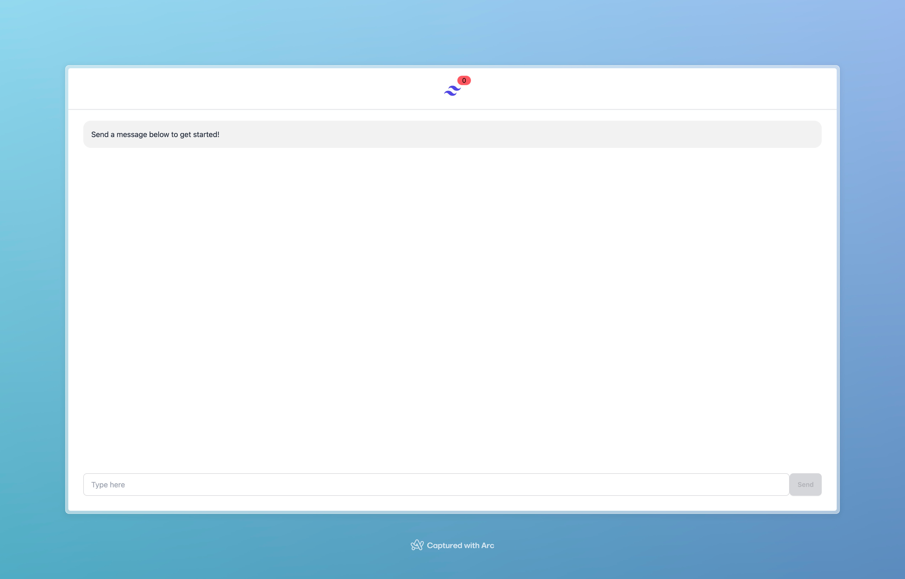

# Interview Exercise App

## Running locally

In order to run locally you'll need the `interview_exercise` backend repo cloned as well as this one.

- Ensure you have the required dependencies installed from the `interview_exercise` repo
- Start the `interview_exercise` backend, `docker compose up -d` & `npm run start:dev`
- In the `interview_exercise` repo generate a JWT token for a dummy user,
  `npm run token --userId 66e70bdf04f6c70771f4a2df --universityId 66e70bde2e3b1e0771a83877`
- In the `interview_exercise` repo mock the user service, `npm run mock-user-server --userId 66e70bdf04f6c70771f4a2df`
- In this repo create a `.env.local` file and complete the following fields
    - `API_KEY` - This is provided in the `interview_exercise` repo
    - `JWT` - This was generated previously with the `token` command
    - `UNIVERSITY_ID` - This is listed above
    - `USER_ID` - This is listed above
- In this repo run `npm start dev` and navigate to [http://localhost:8080](http://localhost:8080)

The app should now be running!

## Testing

Unit tests can be added using `jest` and `react-testing-library`, any files matching `*.test.*` or `*.spec.*` will
automatically be picked up by `jest`.

## Interacting with the API

We use `react-query` here to make state manangement and network requests efficient and easy. Hooks isolate query logic
in separate files making requests reusable and ensuring single sources of truth. `react-query` also works with `graphql`
using `graphql-request`, documents are created that match the expected schema from the API and can be utilised to make
requests as expected.